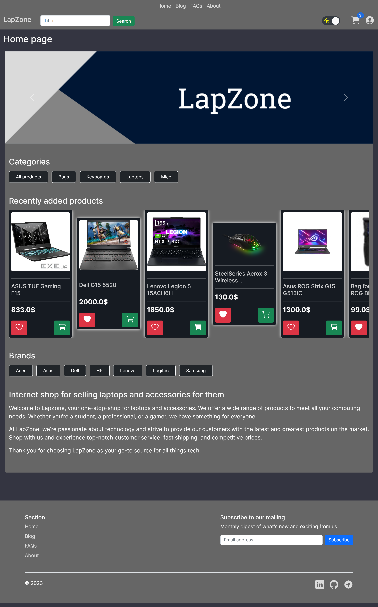

_Internet shop for selling laptops and accessories for them_

### Demo

Click **<a href="https://lapzone.tech" target="_blank">here</a>** to open LapZone internet shop

### Project modules (production)

       

---

### Site structure

The system consists of the following main functional blocks:

-   Registration, authentication and authorization;
-   Guest functionality;
-   User functionality;
-   Admin functionality.

#### Project apps

-   Shop (for working with displaying product lists, product details, brands, etc.);
-   Customer (for working with user profiles and pages that are connected with them);
-   Cart (for working with a user's or guest's cart through sessions);
-   Order (for working with user orders and payments);
-   Mailing (for working with mailing).

#### Technology stack

-   Backend:
    -   Python programming language;
    -   Django framework with the following extensions:
        -   django-allauth;
        -   django-ckeditor;
        -   django-recaptcha3.
    -   PostgreSQL database (Django ORM);
-   Frontend:
    -   HTML & CSS;
    -   JavaScript;
    -   Bootstrap 5.
