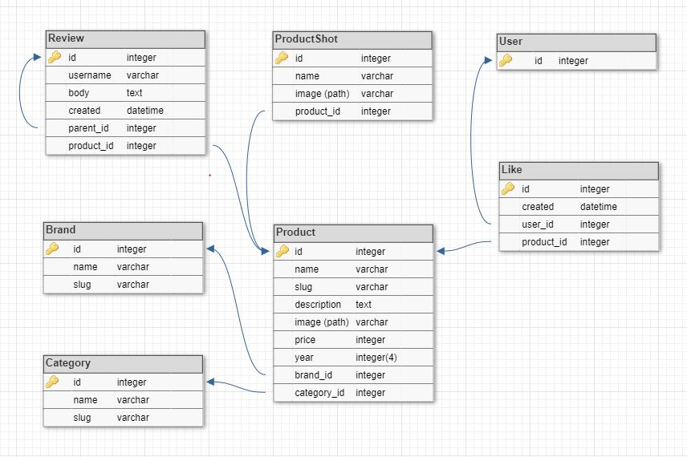
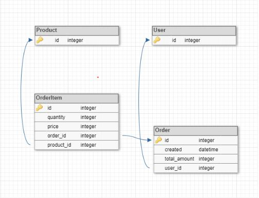

# 1. Introduction

Internet shop "LapZone".

## 1.1 Purpose

Write an internet shop to practice working with the Django framework. Make the market a place for selling laptops and accessories for them.
Everyone can visit the site, visit the "About" and "FAQs" pages, search products, go to their detail pages, etc.
Only registered users can have a personal account on the site, have a wish list, look at their orders, etc.

## 1.2 Scope

-   Write site markup;
-   Use Bootstrap 5 for some custom styles;
-   Write a Django site using Python;
-   Work out the structure of the database;
-   Deploy the site to hosting.

## 1.3 Overview

-   General pages
    -   Home page (with all product categories, new products, brands, etc)
    -   Product detail page
    -   Cart page
    -   Order page
    -   About page
    -   FAQs page
    -   Feedback page
    -   Page to unsubscribe from mailing
-   Auth pages
    -   Login page
    -   Logout page
    -   Register page
    -   Email confirmation page
    -   Password change page
    -   Password reset page
-   User pages
    -   Profile page
    -   Wish list page
    -   Page with orders
    -   Profile edit page
-   Admin page

# 2. Functional requirements

The system consists of the following main functional blocks:

-   Registration, authentication and authorization;
-   Guest functionality;
-   User functionality;
-   Admin functionality.

## 2.1. User types

The system provides for three types of people:

-   Guest (a person who can visit general pages and make orders);
-   User (a registered person who can have personal account and wish list);
-   Admin (a person who has permission to access the admin panel).

> When a guest makes an order and fills in the personal information fields for it, he automatically becomes a user.

## 2.2. Registration

> Use Django extension "django-allauth" for auth functionality

Registration should consist of username and password.

The registration form should include fields such as:

1. Username (required field);
2. Password (required field);
3. Password again (required field, which should be equal to the first password field).

> Add registration through social networks such as Google (Facebook).

## 2.3. User authentication

User authentication should be by username and password.

## 2.4. Admin authentication

Admin authentication should be by username and password.

## 2.5. Guest functionality

Guest can:

-   Visit the "Home", "About", "FAQs" pages;
-   Visit the product detail page;
-   Leave product reviews;
-   Fill out a cart;
-   Make an order;
-   Visit the "Feedback" page and send a feedback email.

Guest cannot:

-   Have a wish list
-   Have a personal profile

### 2.5.1. Leaving reviews for a product

Everybody can see the special form for leaving reviews under each product detail. Review will consist of a name, email, body and the date and time they were created.

## 2.6. User functionality

After authentication, the user gets access to such functional blocks as:

-   Having a wish list;
-   Having a order list;
-   Having a personal profile;
-   Editing a personal profile.

### 2.6.1. Wish list

The user has access to a "wish" button next to each product. This "like" button should be on the product card for all products and on every product detail page.

### 2.6.2. Having a personal profile

General information about the user should be printed:

-   Email,
-   Username,
-   Count of user:
    -   Wishes,
    -   Orders.

And a profile should consist of the following pages:

-   User wishes,
-   User orders.

> On these pages, users can see and delete information.

### 2.6.3. Editing personal profile

The user can edit personal information:

-   Email,
-   Username,
-   Password.

## 2.7. Admin functionality

Django admin functionality.

> Add all models for admin to show them on admin pages.

# 3. Development requirements

-   Technology stack;
-   Apps;
-   Testing;
-   Apps database table structure;
-   General file structure.

## 3.1. Technology stack

To implement the site, the following stack of technologies is proposed:

-   Backend:
    -   Python programming language;
    -   Django framework with the following extensions:
        -   django-allauth;
        -   django-ckeditor;
        -   django-recaptcha3.
    -   PostgreSQL / MySQL database (Django ORM);
-   Frontend:
    -   HTML & CSS;
    -   JavaScript;
    -   Bootstrap 5.

## 3.2. Apps

-   Shop (for working with displaying product lists, product details, brands, etc.);
-   Customer (for working with user profiles and pages that are connected with them);
-   Cart (for working with a user's or guest's cart through sessions);
-   Order (for working with user orders and payments);
-   Mailing (for working with mailing).

## 3.3. Testing

The main test cases are:

-   Models testing
-   Views testing
-   Forms testing

> Write tests just after adding new content (models, views and forms)

### 3.3.1 Models testing

Test model fields and methods (if there are any). Check all field parameters such as max_length, verbose_name, required, blank, etc.

### 3.3.2 Views testing

Test all conditions of views. Check valid and invalid URLs, data, parameters, etc. Test all HTTP methods that view can answer.

### 3.3.3 Forms testing

Test form fields and validation methods (if there are any). Check all field parameters. Test validation with valid and invalid data.

## 3.4. Apps database table structure

Apps that need database tables (models):

-   Shop
-   Order
-   Mailing

### 3.4.1. Shop

### 3.4.2. Order

### 3.4.3. Mailing

## 3.5. General file structure

<pre>
LapZone
│
│   .gitattributes
│   .gitignore
│   Tech spec.md
│
├───lapzone
│   │   .env
│   │   manage.py
│   │
│   ├───cart
│   │   │   __init__.py       
│   │   │   admin.py
│   │   │   apps.py
│   │   │   forms.py
│   │   │   models.py
│   │   │   services.py       
│   │   │   views.py
│   │   │
│   │   ├───migrations        
│   │   │       __init__.py   
│   │   │
│   │   └───tests
│   │           __init__.py   
│   │           test_forms.py 
│   │           test_models.py
│   │           test_views.py 
│   │
│   ├───customer
│   │   │   __init__.py
│   │   │   admin.py
│   │   │   apps.py
│   │   │   forms.py
│   │   │   models.py
│   │   │   services.py
│   │   │   views.py
│   │   │
│   │   ├───migrations
│   │   │       __init__.py
│   │   │
│   │   └───tests
│   │           __init__.py
│   │           test_forms.py
│   │           test_models.py
│   │           test_views.py
│   │
│   ├───general
│   │       __init__.py
│   │       error_views.py
│   │       models.py
│   │       views.py
│   │
│   ├───lapzone
│   │       __init__.py
│   │       asgi.py
│   │       settings.py
│   │       urls.py
│   │       wsgi.py
│   │
│   ├───mailing
│   │   │   __init__.py
│   │   │   admin.py
│   │   │   apps.py
│   │   │   forms.py
│   │   │   models.py
│   │   │   services.py
│   │   │   views.py
│   │   │
│   │   ├───migrations
│   │   │       __init__.py
│   │   │
│   │   └───tests
│   │           __init__.py
│   │           test_forms.py
│   │           test_models.py
│   │           test_views.py
│   │
│   ├───media
│   ├───order
│   │   │   __init__.py
│   │   │   admin.py
│   │   │   apps.py
│   │   │   forms.py
│   │   │   models.py
│   │   │   services.py
│   │   │   views.py
│   │   │
│   │   ├───migrations
│   │   │       __init__.py
│   │   │
│   │   └───tests
│   │           __init__.py
│   │           test_forms.py
│   │           test_models.py
│   │           test_views.py
│   │
│   ├───shop
│   │   │   __init__.py
│   │   │   admin.py
│   │   │   apps.py
│   │   │   forms.py
│   │   │   models.py
│   │   │   services.py
│   │   │   views.py
│   │   │
│   │   ├───migrations
│   │   │       __init__.py
│   │   │
│   │   └───tests
│   │           __init__.py
│   │           test_forms.py
│   │           test_models.py
│   │           test_views.py
│   │
│   ├───static
│   │   ├───css
│   │   ├───images
│   │   └───js
│   └───templates
│       │   _base.html
│       │
│       └───utils
├───md_images
│   │   header.png
│   │
│   └───apps_db
│           mailing.jpg
│           order.jpg
│           shop.jpg
│
└───requirements
        base.txt
        development.txt
        production.txt
</pre>

# 4. Non-functional requirements

-   Localization and languages
-   Design requirements
    -   General site structure
    -   Layout requirements
-   Graphic content
-   Website domain, hosting
-   Browser support
-   Requirements for the development of the site from the standpoint of search engine promotion
    -   General
    -   Text
    -   Images
    -   Meta tags

## 4.1. Localization and languages

The site must be implemented in English.

## 4.2. Design requirements

Minimalist design with clear content. Site layout must be implemented on the Bootstrap 5 layout framework because Bootstrap supports the latest, stable releases of all major browsers and platforms.

### 4.2.1 General site structure

-   Header
-   Main
-   Footer

The site header should have a light/dark mode switcher. The footer of the site should have a logo and links to the author's social networks.

### 4.2.2 Layout requirements

-   Should be displayed correctly, both on computers and on mobile devices;
-   Should be cross-browser.

## 4.3 Graphic content

-   Favicon image (website icon for the browser);
-   Application logo image;
-   Icon set on [ionicons](https://ionic.io/ionicons).

## 4.4 Website domain, hosting

Use Render hosting (which will give us a domain) to deploy the site because it has web services support and provides a PostgreSQL database.

> Use PythonAnywhere as a fallback

## 4.5 Browser support

The site should open and function correctly in the current versions of the main popular browsers: Chrome, Firefox, Safari, etc.

## 4.6 Requirements for the development of the site from the standpoint of search engine promotion

### 4.6.1 General

The site must meet the requirements of the Google search engine for ease of viewing on mobile devices. The requirements are displayed at https://developers.google.com/speed/docs/insights/mobile.

### 4.6.2 Text

-   It is necessary to place the text in the form of text (not pictures). It is desirable that the text be available immediately and not open on click, hover, etc. The text should not be hidden by JavaScripts;
-   The text on the site should be easy to read, formatted, and not contain spelling errors;
-   All site pages must contain unique text;
-   The text of the page should contain 1 heading with the H1 tag, which should include key words and phrases. There can be 2 headings with the H2 tag in the text, and they should also include keywords and phrases. You can't put all the text on the page in the title tag;
-   Headings should at least partially match the navigation.

### 4.6.3 Images

-   An alt-attribute must be registered for all pictures. You can't put more than 7 words in an alt attribute. As for images, they must be unique;
-   Only popular image extensions (JPEG and PNG) should be used.

### 4.6.4 Meta tags

-   It should be possible to edit meta tags and add text;
-   The \<title> tag must match the content of the page and include the main search queries, must include no more than 64 words;
-   The \<description> meta tag should be a brief and precise description of the content of the page and should not be the same as the \<title> tag.
